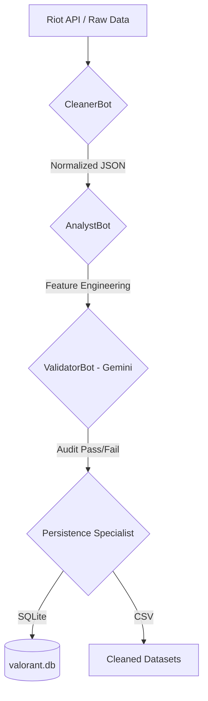

# 🛡️ Aurora: Valorant Data Ingestion Workflow

This document explains the architecture and operational logic of the **Multi-Agent Ingestion Pipeline** for the Valorant Insight AI (Aurora) platform.

## 🏗️ Architecture Overview

The pipeline transitions from raw, nested API telemetry to structured, analytical intelligence using a sequential agentic workflow powered by **LangChain** and **Google Gemini**.

---

## 🤖 The Data Ingestion Agents

### 1. CleanerBot (The Data Engineer)
*   **Role**: Handles the "Extraction & Transformation" (ETL).
*   **Logic**: 
    *   Ingests raw, deeply nested JSON from Riot Games.
    *   Flattens structures (e.g., metadata, map info).
    *   Removes redundant telemetry and noise.
*   **Result**: A clean, flat table structure ready for statistical analysis.

### 2. AnalystBot (The Tactical Analyst)
*   **Role**: Performs "Feature Extraction".
*   **Logic**: 
    *   Extracts specific player statistics (Kills, Deaths, Assists, Agent used).
    *   Links player performance to specific match IDs.
    *   Prepares data for OVR (Overall Rating) calculations.
*   **Result**: Granular player-level datasets that allow for cross-match performance tracking.

### 3. ValidatorBot (The Auditor - Gemini 1.5/2.5 Flash)
*   **Role**: "Quality Assurance (QA) & Reasoning".
*   **Logic**: 
    *   Analyzes the cleaned outputs using Large Language Model reasoning.
    *   Checks for schema inconsistencies (e.g., naming mismatches).
    *   Identifies data outliers (e.g., impossible scores) or missing critical fields.
*   **Result**: An "Audit Report" that either authorizes the data for permanent storage or flags specific errors for developers.

### 4. Persistence Specialist (The Database Admin)
*   **Role**: "Loading & Storage".
*   **Logic**: 
    *   Converts JSON outputs into physical storage formats.
    *   Writes to **SQLite** (`valorant.db`) for fast analytical queries.
    *   Generates **CSV files** (`matches_clean.csv`) for Business Intelligence tools (PowerBI/Excel).
*   **Result**: Permanent, production-ready data assets.

---

## 📈 Verification Results

When you run `test_pipeline.py`, you are witnessing the **Synergy** between these agents:

1.  **Cleaner & Analyst** work silently to compress 100KB of raw JSON into a precise 5KB feature set.
2.  **Validator (Gemini)** provides the human-like insight we saw earlier: *"Warning: 'matchid' vs 'match_id' naming inconsistency found."* This prevents bugs that regular code would miss.
3.  **Persistence** confirms: *"Successfully persisted 200 records."*

## 🎯 Final Value Proposition
Unlike traditional scripts, this **Multi-Agent** approach ensures that your data is not just "moved"—it is **understood**, **verified**, and **optimized** by AI before it even reaches your dashboard.
